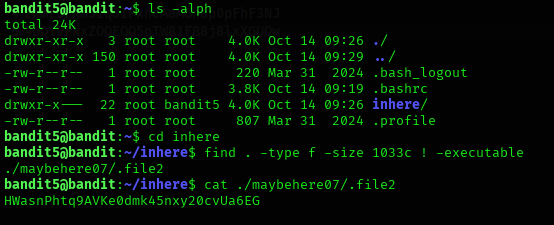

## Bandit Level 05 → Level 06

### 🎯 Objective  
Log in as bandit5 and retrieve the password for the next level from a specific file located inside the `inhere` directory. The target file is non-executable, human-readable, and exactly 1033 bytes in size.

---

### 🔑 Credentials Provided  
Username: bandit5  
Password: Obtained from previous level  

---

### 🔍 Method of Solve  
The `inhere` directory contains many files with different attributes.  
The password is stored in a file that:
- Is a regular file
- Has size exactly 1033 bytes
- Is NOT executable  

So the task is to search files matching all these conditions and then read the correct file.

---

### 🧪 Commands Used  
- ls -alph  
- cd inhere  
- find . -type f -size 1033c ! -executable  
- cat ./maybehere07/.file2  

---

### 🔑 Next Level Password  
HWsAmPhtg9AVKe0dmk45nxy20cVua6EG

---

### 🧠 Explanation  
The `ls -alph` command lists all files, including hidden ones, and reveals the `inhere` directory.  
After navigating inside using `cd inhere`, the `find` command is used to filter files based on conditions:

- `-type f` → selects only regular files  
- `-size 1033c` → selects files exactly 1033 bytes in size  
- `! -executable` → excludes executable files  

The matching file path returned is `./maybehere07/.file2`.  
Using `cat` displays its contents, revealing the password.

---

### 🔐 Concept Learned  
This level teaches advanced use of the `find` command to locate files based on multiple properties.  
It also reinforces working with hidden files and understanding file permissions in Linux.
