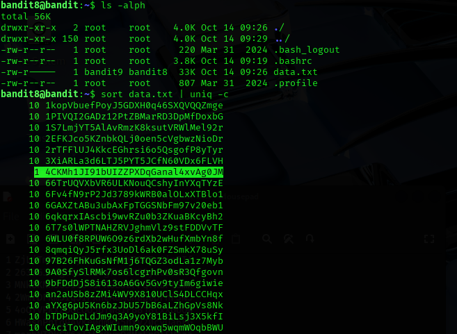

## Bandit Level 08 → Level 09

### 🎯 Objective
Find the password for the next level. The password is stored in the file `data.txt`, which contains many lines of text. Among all those lines, only one line is unique (appears exactly once). That unique line is the password.

---

### 🔑 Credentials Provided
Username: bandit8  
Password: (Password obtained from previous level)

---

### 🔍 Method of Solve
The `data.txt` file contains thousands of lines, most of which are repeated multiple times.
We need to identify the line that appears only once.

To do this:
1. Sort the file so that identical lines group together
2. Use `uniq -c` to count repetitions of each line
3. Identify the line with count `1`, because that is the unique line and is the password

---

### 🧪 Commands Used (Bash)
- `ls -alph`
- `sort data.txt | uniq -c`

---

### 🧠 Screenshot (Paste your screenshot here)

---

### 🔑 Next Level Password
4CKMh1JI9DHuZPXDGsGna4LvxAg0JYw

---

### 🧠 Explanation
The `sort` command arranges all lines in ascending order, ensuring identical lines are grouped together.  
The `uniq -c` command then counts how many times each line appears.  
Most lines appear multiple times, but the challenge tells us only one line is unique.  
Therefore, we simply locate the line with the count `1`, and that line is the password.

---

### 🔐 Concept Learned
- Sorting large text files using `sort`
- Identifying unique or repeated lines using `uniq -c`
- Understanding how sorting and text processing tools help in CTF challenges
