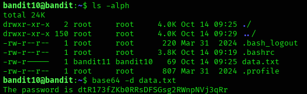

## Bandit Level 10 → Level 11

### 🎯 Objective
Log in as bandit10 and retrieve the password for the next level from a file encoded in Base64 format.

---

### 🔑 Credentials Provided
Username: bandit10  
Password: (Obtained from previous level)

---

### 🔍 Method of Solve
The file `data.txt` contains encoded text.  
Base64 is a common encoding technique used to convert binary/ASCII data into readable characters.  
To obtain the real password, the file must be decoded using the Base64 decoding command.

---

### 🧪 Commands Used (Bash)
- `ls -alph`
- `base64 -d data.txt`

---

### 🧠 Screenshot (Paste your screenshot here)

---

### 🔑 Next Level Password
dtR173fZKb0RRsDFSGsg2RWnpNVj3qRr

---

### 🧠 Explanation
The `ls -alph` command is used to list all files in the directory, confirming the presence of `data.txt`.  
The `base64 -d data.txt` command decodes the Base64 encoded text inside the file.  
Once decoded, it reveals a clear English text stating the next level password.

---

### 🔐 Concept Learned
- Understanding Base64 encoding
- How to decode Base64 using Linux commands
- Recognizing encoded data in CTF challenges
