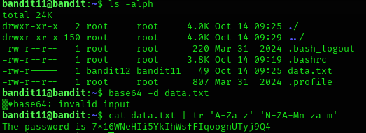

## Bandit Level 11 → Level 12

### 🎯 Objective
Log in as bandit11 and obtain the password for the next level from a file that is encoded using ROT13 encryption.

---

### 🔑 Credentials Provided
Username: bandit11  
Password: Obtained from previous level  

---

### 🔍 Method of Solve
The file `data.txt` contains text that is not readable because it is encoded using ROT13.  
ROT13 is a simple substitution cipher where each letter is rotated 13 places in the alphabet.  
By decoding the file using the `tr` command, we can convert it back to readable text and extract the password.

---

### 🧪 Commands Used (Bash)
- `ls -alph`
- `cat data.txt | tr 'A-Za-z' 'N-ZA-Mn-za-m'`

---

### 🧠 Screenshot (Paste your screenshot here)

---

### 🔑 Next Level Password
7x116WeNHelI5YkTIhWsFFjoognoUYrj90q4

---

### 🧠 Explanation
First, `ls -alph` is used to view the files in the current directory and confirm the presence of `data.txt`.  
Next, the `tr 'A-Za-z' 'N-ZA-Mn-za-m'` command performs ROT13 decryption by shifting each letter 13 positions.  
The decoded text reveals the sentence containing the next level password.

---

### 🔐 Concept Learned
- Understanding ROT13 encryption
- Using the `tr` command to perform substitution decoding
- Identifying and decoding encoded text in CTF challenges
