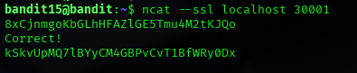

## Bandit Level 15 → Level 16

### 🎯 Objective
Connect to a secure SSL-enabled service running on the local machine and retrieve the password for the next level by providing the correct authentication password.

---

### 🔑 Credentials Provided
Username: bandit15  
Password: 8xCjnmgoKBGhLHfFAZ1GEl5Tmu4M2tKJQ0

---

### 🔍 Method of Solve
A service is running locally on port `30001`, but unlike the previous level, it requires an encrypted SSL connection.  
We must connect to this SSL-enabled port and provide the password for bandit15.  
If the password is correct, the service returns the password for the next level.

---

### 🧪 Commands Used (Bash)
- `ncat --ssl localhost 30001`
- Enter the bandit15 password when prompted

---

### 📷 Screenshot (Paste Here)

---

### 🔑 Next Level Password
kSkVUpMQ7lBYcVM4GBPvCvt1BfWRy0Dx

---

### 🧠 Explanation
Unlike normal netcat connections, this level requires encrypted communication.  
The `--ssl` option in `ncat` enables SSL encryption, allowing secure interaction with the service.  
Once connected, submitting the correct password results in a success message and displays the password for the next level.

---

### 🔐 Concept Learned
- Working with secure SSL communication
- Using Ncat with SSL support
- Understanding encrypted services in CTF environments
